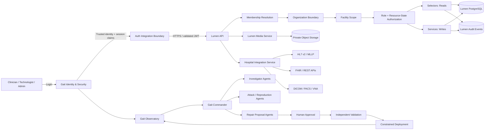
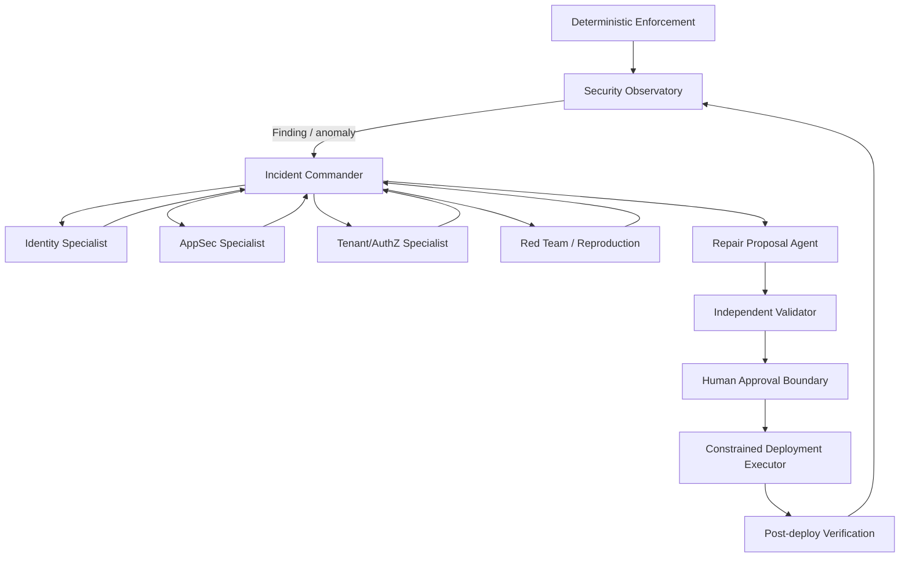
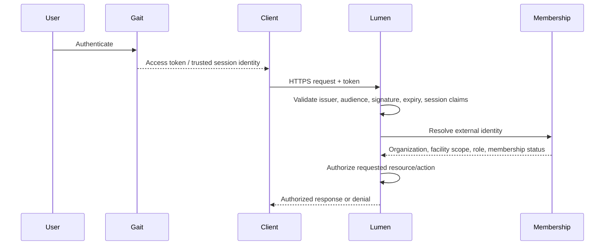
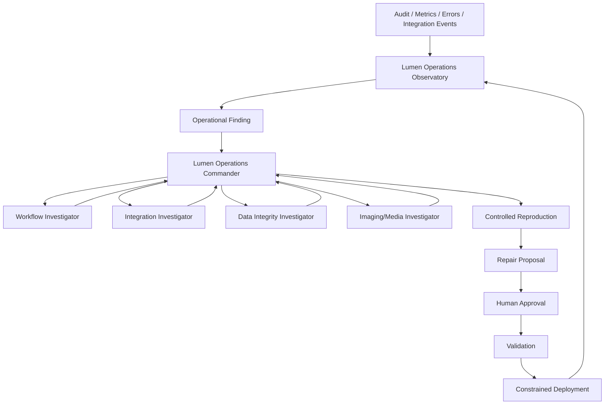
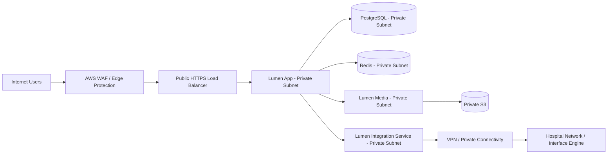

# Lumen Security, Tenancy & Integration Architecture Handbook

**Version:** 0.1 — Working Architecture Reference  
**Audience:** Founder, engineers, hospital IT/security teams, clinical leadership, implementation teams, and future contributors  
**Purpose:** Provide a durable mental model and implementation reference for how Gait, Lumen, tenancy, authorization, observability, agents, media, and hospital integrations fit together.

---

## 1. The Five Sentences to Know Cold

1. **Gait proves who you are; Lumen decides what you are allowed to do.**
2. **Organization is Lumen's hard tenant boundary; Facility is a subordinate scope inside that tenant.**
3. **Authentication never equals clinical access: every request still requires membership, scope, role, and resource-state authorization.**
4. **Selectors protect reads, services protect writes, and the client is never trusted to declare its own authority.**
5. **Intelligence can observe, investigate, reproduce, and recommend; humans retain approval authority for consequential changes.**

These five sentences are the shortest accurate explanation of the platform's security model.

---

## 2. Executive Summary

Lumen is a multi-tenant clinical reporting platform. Gait is the external identity and security control plane that authenticates users and operates its own security observability and agent workflow. Lumen does not delegate clinical authorization to Gait. Instead, Lumen accepts a trusted identity from Gait and independently resolves that identity into organization membership, facility scope, role, and workflow permissions.

The architecture deliberately separates **identity security** from **clinical authorization**:

- **Gait** owns authentication, token/session security, security observability, security agents, approval boundaries, and validation of Gait itself.
- **Lumen** owns tenant isolation, facility boundaries, business roles, clinical workflow authorization, exam state, reporting truth, media associations, and clinical auditability.
- **Lumen Media** owns secure image/media storage and retrieval boundaries.
- **Integration services** own communication with external hospital systems such as Epic, Oracle Health/Cerner, MEDITECH, PACS/VNA, and other HL7/DICOM endpoints.

The guiding principle is that no single layer is trusted to do everything. Identity, tenancy, business authorization, data access, and automation are independently constrained.

---

## 3. System Context Diagram



### Mental model

A request does **not** flow directly from login to data. It flows through multiple independent checks:

**User → Gait identity → integration boundary → Lumen membership → organization → facility → role → resource state → selector/service → data.**

---

## 4. Trust Boundaries

### 4.1 Boundary A — The User Device

The browser, mobile client, or external consumer is **untrusted**.

The client may request an organization, facility, exam, or action, but it cannot prove that the user is entitled to any of them.

The following values must never be accepted as authoritative merely because the client sends them:

- `organization_id`
- `facility_id`
- `role`
- `is_admin`
- `is_physician`
- `can_sign`
- `can_finalize`
- ownership claims
- uploader identity
- agent authority

The backend resolves or validates these values independently.

### 4.2 Boundary B — Gait

Gait answers the identity question:

> **Who is making this request, and is this authentication/session trustworthy?**

Gait should provide Lumen only the minimum identity material necessary for Lumen to resolve local authorization.

Typical trusted claims include:

- external user identifier / subject (`sub`)
- session identifier (`sid`)
- token issuance and expiry
- issuer and audience
- authentication assurance information where applicable

Gait should **not** become the source of truth for Lumen's business roles or tenant membership.

### 4.3 Boundary C — Lumen Authorization

Lumen answers:

> **Given this authenticated identity, what tenant, facility, resources, and clinical actions may this person access?**

Lumen resolves the external identity against its own membership tables and business rules.

### 4.4 Boundary D — External Hospital Systems

Epic, Oracle Health/Cerner, MEDITECH, PACS, VNAs, interface engines, and other external systems are separate trust domains.

Every integration must define:

- authentication mechanism
- transport security
- expected message contract
- facility/system identity
- allowed message types
- retry rules
- duplicate handling
- failure handling
- reconciliation
- audit trail

---

## 5. Gait: Identity & Security Control Plane

### 5.1 Responsibilities

Gait owns:

- user authentication
- token issuance
- refresh-token lifecycle
- session identity
- session revocation
- replay detection
- authentication enforcement
- security events
- security observability
- autonomous security analysis within bounded authority
- human approval of consequential repair/deployment operations

Gait does **not** decide whether a physician may sign a carotid report or whether a technologist may access Facility B.

Those are Lumen decisions.

---

## 6. Gait Security Observatory & Agent Organization



### 6.1 Core principle

> **Intelligence does not grant authority.**

An agent may conclude that a fix is appropriate. That conclusion does not automatically authorize the fix.

### 6.2 Deterministic enforcement comes first

The agent system must sit **behind** deterministic controls such as:

- capability checks
- environment restrictions
- repository/path restrictions
- deployment target binding
- immutable commit binding
- approval validity
- kill switches
- audit logging
- risk ceilings

### 6.3 Agent roles

#### Commander

Coordinates the case and routes work. It should not invent authorization.

#### Investigator agents

Inspect evidence and generate structured diagnosis reports.

Possible specialties:

- Identity
- AppSec
- Tenant/AuthZ
- Deployment/Supply Chain
- AI/Agent Security
- Integration Security

#### Red Team / reproduction agents

Attempt to reproduce a suspected weakness in a controlled environment.

#### Repair agents

Produce a bounded repair proposal, risk explanation, tests, and rollback plan.

#### Validator

Independently verifies the proposed repair against the exact source/commit that was approved.

#### Human approval

The human is the authority boundary for consequential changes.

#### Deployment executor

Deploys exactly what was validated and approved. It does not choose what to deploy.

---

## 7. Authentication Integration: Gait → Lumen

### 7.1 Recommended transport

Use standard **HTTPS with TLS** for Gait-to-Lumen authentication/integration traffic.

For stronger service-to-service trust, consider **mutual TLS (mTLS)** in addition to normal token validation.

Do not invent a custom raw TCP authentication protocol.

### 7.2 Request flow



### 7.3 Important invariant

A valid Gait token means:

> **This identity is authenticated.**

It does **not** mean:

> **This identity can access a particular Lumen organization, facility, exam, image, or action.**

---

## 8. Lumen Tenancy Model

### 8.1 Core entities

```mermaid
erDiagram
    ORGANIZATION ||--o{ FACILITY : contains
    ORGANIZATION ||--o{ ORGANIZATION_MEMBER : has
    FACILITY ||--o{ ORGANIZATION_MEMBER : optionally_scopes
    ORGANIZATION ||--o{ EXAM : owns
    FACILITY ||--o{ EXAM : performed_at
    EXAM ||--o{ SEGMENT : contains
    SEGMENT ||--o{ MEASUREMENT : contains
    EXAM ||--o{ MEDIA_OBJECT : references
    EXAM ||--o{ AUDIT_EVENT : emits

    ORGANIZATION {
        uuid id PK
        string name
        boolean active
    }

    FACILITY {
        uuid id PK
        uuid organization_id FK
        string name
        boolean active
    }

    ORGANIZATION_MEMBER {
        uuid id PK
        uuid organization_id FK
        uuid facility_id FK nullable
        string external_identity
        string role
        boolean active
    }

    EXAM {
        uuid id PK
        uuid organization_id FK
        uuid facility_id FK
        string exam_type
        string workflow_state
    }

    AUDIT_EVENT {
        uuid id PK
        uuid organization_id FK
        uuid facility_id FK nullable
        string actor_external_id
        string action
        string resource_type
        uuid resource_id
        datetime occurred_at
    }
```

### 8.2 Organization is the hard tenant boundary

Every tenant-owned clinical resource must belong to exactly one organization.

Examples:

- exams
- reports
- facilities
- protocols
- criteria profiles
- media references
- audit events
- integration configuration

### 8.3 Facility is subordinate scope

An organization may contain:

- one facility
- many facilities

Facility boundaries allow a health system to share a platform while keeping operational configuration and staff scope separated where needed.

Examples of facility-specific configuration:

- exam protocols
- interpretation criteria
- report branding
- workflow options
- modality endpoints
- local integration routes
- clinician membership

### 8.4 Membership binds identity to Lumen authority

`OrganizationMember` is the bridge between external identity and Lumen business access.

It answers:

- Does this identity belong to this organization?
- Is the membership active?
- Is the user scoped to one facility or multiple facilities?
- What Lumen role does the member have?

---

## 9. Authorization Model

Authorization should be evaluated across multiple dimensions.

### 9.1 Identity

Is the request authenticated by a trusted issuer?

### 9.2 Membership

Is the external identity an active member of the organization?

### 9.3 Tenant

Does the requested resource belong to the same organization?

### 9.4 Facility

If facility scoping applies, is the user permitted to operate within that facility?

### 9.5 Role

Does the user's business role permit the requested class of action?

Example roles:

- Owner
- Admin
- Physician
- Technologist

### 9.6 Resource state

Even a role that normally has permission may be denied based on workflow state.

Examples:

- a finalized exam may be read-only
- only an authorized physician may sign
- an addendum workflow may be required after finalization
- a locked report cannot be silently changed

---

## 10. Read vs Write Architecture

### 10.1 Selectors protect reads

Selectors are responsible for returning only data the caller may see.

A selector should not begin with:

> “Find Exam ID 123.”

It should begin conceptually with:

> “Within this authenticated member's organization/facility scope, find Exam ID 123.”

### 10.2 Services protect writes

Services are responsible for mutations and business invariants.

A service should:

1. resolve/receive trusted actor context
2. load the target resource inside tenant scope
3. verify role/capability
4. verify workflow state
5. execute the mutation atomically
6. emit audit/observability events
7. return a contract-safe result

### 10.3 Views orchestrate; they do not own business truth

Views/ViewSets should:

- authenticate
- parse the request
- invoke selectors/services
- serialize the response

They should not become the only place where tenant isolation or workflow rules exist.

---

## 11. Tenant-Isolation Invariants

These should be treated as non-negotiable system properties.

1. Every tenant-owned clinical resource has an `organization_id`.
2. Tenant-owned resources are never queried globally in request paths without an explicit tenant scope.
3. Client-provided `organization_id`, `facility_id`, or `role` is never sufficient authorization.
4. Cross-organization resource access returns no data.
5. Facility restrictions are applied independently of role.
6. An inactive membership authorizes nothing.
7. A valid Gait identity with no Lumen membership authorizes nothing.
8. Role checks never replace tenant checks.
9. Tenant checks never replace resource-state checks.
10. Background jobs and integration workers are tenant scoped too.
11. Media access must be tenant and facility authorized before presigning.
12. Audit records retain enough context to reconstruct who acted on what tenant/resource and when.

---

## 12. Lumen Audit Trail vs Observability

These are related but different systems.

### 12.1 Audit trail answers

> **What happened? Who did it? To what resource? When?**

Examples:

- exam created
- exam edited
- measurement changed
- report finalized
- report unfinalized
- addendum created
- image associated
- image reassigned
- permission denied
- integration message sent
- integration message failed
- criteria profile changed
- protocol changed

### 12.2 Observability answers

> **Is the platform behaving normally, safely, and consistently?**

Examples:

- sudden spike in failed HL7 messages
- unusual cross-facility authorization denials
- repeated failed finalize attempts
- media presign failures
- abnormal report-generation latency
- stuck workflows
- unexpected DICOM reconciliation volume
- failed background jobs
- facility-specific error spikes
- repeated session/authentication failures arriving from Gait

---

## 13. Lumen Operations Observatory

Lumen can adopt an agent-assisted pattern similar to Gait, but focused on operational and product integrity.



### 13.1 Important distinction

Gait's observatory watches **security posture**.

Lumen's observatory watches **clinical software operations, workflow integrity, data integrity, and integration health**.

Do not merge the two into one indistinguishable agent system.

---

## 14. Clinical Safety Boundary

AI/agents may:

- explain protocols
- summarize standards
- identify inconsistent data
- detect workflow anomalies
- recommend technical repairs
- propose configuration changes
- produce drafts for review

AI/agents should not independently:

- change signed clinical interpretations
- alter diagnostic criteria in production
- silently reassign patient images
- finalize a report on behalf of a clinician
- override tenant or role authorization
- deploy unapproved changes

Human authority remains explicit for consequential actions.

---

## 15. Lumen Media Security Model

### 15.1 Responsibilities

Lumen Media should own:

- media ingestion
- private object storage
- authorized media retrieval
- presigned upload/download URLs
- tenant/facility verification
- uploader identity binding
- image metadata
- media lifecycle management
- future DICOM workflows

### 15.2 Recommended transfer pattern

For large stored media such as cine loops:

**Browser → authorized presigned URL → object storage**

Do not route large media bytes through Django unless there is a specific reason.

### 15.3 Retrieval performance

For stored cine loops, optimize with:

- HTTPS
- object storage
- CDN where appropriate
- byte-range requests
- efficient encoding
- thumbnails/posters
- streaming-friendly formats
- background transcoding where needed

Raw application sockets are generally not the right bulk-delivery mechanism.

---

## 16. DICOM Imaging Integrity & Reconciliation

Misassigned imaging is a patient-safety and data-integrity problem and deserves its own subsystem.

### 16.1 Do not build a casual freeform editor

Instead, build an **Imaging Integrity & Reconciliation Workspace**.

### 16.2 Reconciliation workflow

1. Detect or report suspected misassignment.
2. Identify the affected study, series, or instances.
3. Resolve the correct patient against a trusted source.
4. Show before/after metadata.
5. Require a reason for correction.
6. Require appropriate authorization.
7. Create corrected DICOM objects according to DICOM rules and institutional policy.
8. Preserve provenance.
9. Re-route corrected images to the correct archive/report context.
10. Prevent silent overwrites.
11. Emit immutable audit events.
12. Reconcile downstream systems.

### 16.3 Important evidence to retain

- original patient/study identifiers
- corrected identifiers
- affected SOP Instance UIDs / series
- actor
- approver where required
- reason
- timestamp
- destination/archive acknowledgement
- before/after metadata hash or equivalent evidence

---

## 17. Hospital Integration Architecture

### 17.1 Integration service is a separate boundary

A production HL7 listener should be a dedicated long-running service, not merely a Django management command.

Conceptually:

```text
Hospital Interface Engine / EHR
        |
     MLLP/TCP
        |
Lumen Integration Service
        |
 HTTPS / internal API / event boundary
        |
     Lumen Core
```

### 17.2 Why separate it

It isolates:

- persistent TCP connections
- MLLP framing
- retries
- acknowledgements
- message deduplication
- vendor/site-specific profiles
- dead-letter/reconciliation logic
- integration observability

from the clinical application request lifecycle.

### 17.3 One core engine, configurable profiles

Do not build separate entire systems for Epic, Oracle Health/Cerner, and MEDITECH.

Build:

- one standards-based integration core
- vendor/site adapters or profiles
- configurable message mappings
- configurable required fields
- local interface rules

---

## 18. AWS Network Architecture

A strong baseline deployment model is:



### 18.1 Key rules

- application servers should not need public IPs
- database should not be internet reachable
- only required ports should be open
- security groups should express service-to-service intent
- secrets should live in a managed secret store
- logs should be centralized
- encryption should be enabled in transit and at rest
- production admin access should use controlled operational pathways

---

## 19. Security Event Categories to Observe

### Authentication / identity

- invalid tokens
- expired tokens
- revoked sessions
- replay attempts
- issuer/audience mismatch
- abnormal authentication failure rate

### Tenant isolation

- cross-org resource access attempts
- cross-facility access attempts
- membership lookup failures
- unexpected tenant mismatch

### Authorization

- repeated denied actions
- attempted signing by unauthorized role
- attempted mutation of locked/finalized resources

### Clinical workflow

- repeated finalization failures
- unexpected unfinalize frequency
- abandoned exams
- reports stuck in workflow states
- calculation failures

### Media

- presign denials
- suspicious media reassignment
- orphaned objects
- incorrect exam/media associations
- failed DICOM reconciliation

### Integration

- MLLP disconnects
- ACK/NAK anomalies
- repeated message retries
- duplicate inbound orders
- outbound ORU failures
- schema/profile validation failures
- destination unavailable

### Platform

- unusual latency
- elevated 5xx responses
- background job backlog
- DB connection exhaustion
- storage errors

---

## 20. Threat Model — High-Level

| Threat | Primary Control |
|---|---|
| Stolen token | Gait session controls, short-lived access token, revocation |
| Client spoofs org ID | Backend membership and tenant resolution |
| Client spoofs facility | Facility authorization on backend |
| User guesses another exam ID | Tenant-scoped selectors |
| Unauthorized report mutation | Service-layer authorization + workflow-state checks |
| Cross-tenant media access | Media service membership/facility authorization before presign |
| Compromised AI agent | Capability ceiling, gateway, environment restrictions, human approval |
| Unsafe automated deploy | Validation + immutable commit binding + explicit approval + constrained executor |
| HL7 message duplication | Message identity/deduplication + reconciliation |
| Misassigned DICOM | Controlled reconciliation workflow + provenance + audit |
| Insider misuse | Least privilege + audit trail + anomaly detection |
| Public DB exposure | Private network + security groups + no public endpoint |

---

## 21. Security Evidence & Test Strategy

Hospital security teams will eventually ask not only:

> “What do you claim?”

but also:

> “How do you prove it?”

For every major control, maintain evidence.

### 21.1 Example control-evidence matrix

| Control | Evidence |
|---|---|
| Cross-tenant access denied | Automated tests using two organizations |
| Facility restriction enforced | Multi-facility authorization tests |
| Token replay rejected | Gait replay tests / security events |
| Signed report immutable | Workflow-lock tests |
| Media presign tenant scoped | Media authorization tests |
| Agent cannot deploy autonomously | Gateway/approval/deployment tests |
| Integration retries safely | HL7 integration tests |
| Audit emitted on finalization | Audit event tests |

### 21.2 Minimum test classes

- authentication contract tests
- tenant isolation tests
- facility isolation tests
- role permission tests
- workflow-state authorization tests
- media authorization tests
- concurrency tests
- integration contract tests
- audit event tests
- agent authority-boundary tests

---

## 22. Security Review Talking Points

When a hospital security team asks **"How do you handle authentication?"**

> Gait is the external identity and session-security plane. Lumen validates the trusted identity but performs its own tenant and clinical authorization.

When they ask **"How do you prevent one customer from seeing another customer's data?"**

> Organization is a mandatory server-side tenant boundary. Reads are tenant-scoped in selectors, writes are tenant-authorized in services, and the browser cannot declare its own organization authority.

When they ask **"What about multiple hospitals in one health system?"**

> One organization can contain multiple facilities. Facility scope is independently enforced below the organization boundary, allowing system-wide deployment with local workflow and protocol configuration.

When they ask **"Can AI change production?"**

> AI can investigate and propose. Authority remains deterministic and human controlled. Deployment is constrained to validated, explicitly approved artifacts.

When they ask **"What happens if an image is assigned to the wrong patient?"**

> Lumen uses a controlled imaging-reconciliation workflow with trusted identity resolution, explicit authorization, provenance, downstream reconciliation, and an immutable audit trail.

When they ask **"Where is your database?"**

> Application and database services are deployed inside private network boundaries; public traffic terminates at controlled HTTPS ingress, not directly at the database or internal services.

---

## 23. Founder Mental Model

The entire architecture can be remembered as five stacked questions:

### Question 1 — Who are you?

**Gait**

### Question 2 — Which customer do you belong to?

**Lumen Organization Membership**

### Question 3 — Where inside that customer may you operate?

**Facility Scope**

### Question 4 — What may you do to this resource right now?

**Role + workflow state + service/selector authorization**

### Question 5 — Can we prove what happened and detect when the system is unhealthy?

**Audit + observability + bounded agent workflows**

---

## 24. Current Build Priorities

The architecture is intentionally broader than the current implementation. The immediate product objective is still the first reliable vertical slice.

### Phase 1 — Re-establish security boundary

- reintegrate current Gait authentication into Lumen
- verify token/session validation
- verify membership resolution
- verify organization isolation
- verify facility scoping
- verify role enforcement

### Phase 2 — Complete carotid vertical slice

- create carotid exam
- store patient/study context
- capture indication / CPT / protocol data
- capture segments and measurements
- calculate derived values
- generate conclusion
- generate final report
- finalize/sign according to workflow rules
- persist and retrieve the exam

### Phase 3 — Media round trip

- attach test images/cine loops
- private storage
- authorized retrieval
- exam association
- audit relevant operations

### Phase 4 — Harden and demonstrate

- tenant isolation test suite
- workflow authorization tests
- finalization/locking tests
- media authorization tests
- demo seed data
- stable demo environment

### Phase 5 — Clinical review

- demonstrate to clinical leadership/advisors
- collect workflow feedback
- identify pilot endpoints
- freeze pilot scope

### Phase 6 — Hospital integration

- dedicated integration service
- HL7 v2 / MLLP
- order/ADT intake as required
- ORU/report output
- interface observability
- vendor/site profiles

### Phase 7 — Pilot readiness

- implementation plan
- security packet
- data-flow diagram
- risk assessment
- support model
- audit model
- deployment architecture
- clinical validation plan

---

## 25. What Not to Do

Avoid these architectural traps:

- trusting `organization_id` from React
- checking role only in the UI
- allowing views to be the only authorization boundary
- querying resources globally and checking tenant afterward
- mixing Gait business roles with Lumen clinical roles
- letting AI agents hold production authority
- silently editing finalized reports
- silently moving DICOM objects between patients
- streaming all large media through Django
- treating MLLP as just another synchronous web request
- making every hospital integration a completely different codebase
- merging security observability and clinical operations observability into one ambiguous system

---

## 26. Glossary

**Authentication** — Proving identity.

**Authorization** — Determining what an authenticated identity may do.

**Tenant** — A logically isolated customer boundary. In Lumen, the Organization.

**Facility** — A subordinate operational scope within an Organization.

**Membership** — The Lumen record binding an external identity to an organization, role, and optional facility scope.

**Selector** — Read-layer component responsible for authorized/scoped retrieval.

**Service** — Write/business-layer component responsible for mutations and invariants.

**Audit trail** — Durable record of important actions and state changes.

**Observability** — Signals used to understand whether the system is healthy and behaving as expected.

**Finding** — A normalized condition that warrants investigation.

**Commander** — Coordinator/router for agent workflows.

**Capability** — Explicit permission granted to an agent/tool workflow.

**MLLP** — Minimal Lower Layer Protocol, commonly used to transport HL7 v2 messages over TCP.

**DICOM** — Standard for medical imaging objects and associated metadata/workflows.

**FHIR** — REST-oriented interoperability standard for healthcare data exchange.

**mTLS** — Mutual TLS, where both sides authenticate using certificates.

---

## 27. Final Architecture Statement

Lumen's security model is intentionally layered rather than centralized.

**Gait authenticates identity and protects the identity plane. Lumen independently enforces customer tenancy, facility scope, clinical roles, and workflow state. Reads are tenant-scoped through selectors, writes are guarded by services, media is independently authorized, integrations are isolated behind dedicated boundaries, and consequential automation remains constrained by deterministic controls and human authority. Auditability and observability provide evidence that those controls continue to operate as intended.**

That is the architecture you should be able to explain to a clinician, hospital security engineer, implementation team, investor, or future engineer at different levels of depth without changing the underlying truth.

---

## 28. Future Handbook Modules

This handbook should grow with the product. Recommended next modules:

- Detailed Gait authentication contract
- Detailed Lumen RBAC/capability matrix
- Tenant-isolation test catalog
- Facility-configuration architecture
- Audit-event schema
- Lumen observability finding taxonomy
- DICOM ingestion/reconciliation specification
- HL7/MLLP integration handbook
- FHIR integration strategy
- AWS production topology
- HIPAA administrative/technical control mapping
- Backup, disaster recovery, and business continuity
- Key management and secrets lifecycle
- Incident response runbook
- Hospital implementation runbook
- Security questionnaire answer bank
- Threat model using STRIDE or equivalent
- Data retention and deletion policy
- Vendor risk and dependency inventory

